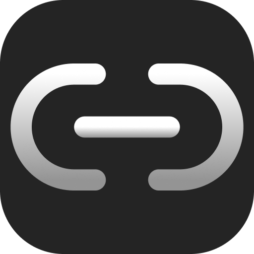
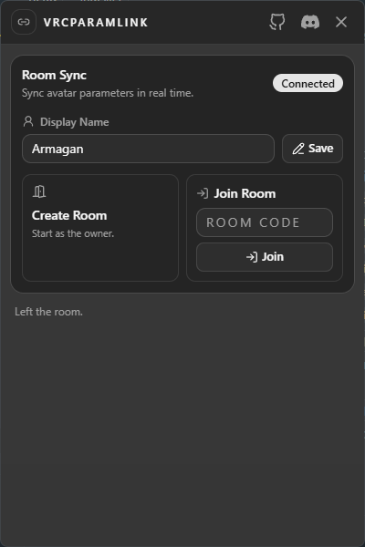
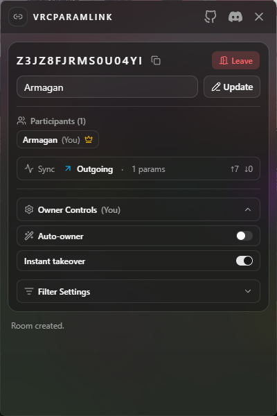

	

<h1 align="center">VRCParamLink</h1>

	Link your avatar parameters with your partner's avatar in VRChat ♡

	<a href="https://github.com/TheArmagan/VRCParamLink/releases"><strong>Download the latest release ♡</strong></a>

	<a href="https://discord.gg/spfmB7S78n"><strong>Join the Discord server ✨</strong></a>

## What Does It Do? 🌸

VRCParamLink lets you sync avatar parameters between everyone in a room — in real time, through VRChat's OSC API.

One person becomes the sync source, and their avatar parameter changes get mirrored to everyone else. But that's not all — **everyone in the room that is using VRCParamLink can edit each other's parameters** too! You can tweak someone's toggles, sliders, or switches right from the app. No owner restriction, just full collaborative chaos.

So if one avatar toggles something cute, matching, silly, spooky, romantic, or dramatic... the other one can follow along — or change it themselves ♡

## Little Peek 👀

	
	

## Features 💞

- **Real-time parameter sync** — owner's avatar changes are mirrored to everyone in the room.
- **Full-body tracking sync** — forward your entire body movement (HMD, controllers, trackers) to other room members via OpenVR. They see you move in real-time — head, hands, hips, feet, everything.
- **Remote parameter editing** — everyone can edit each other's avatar parameters (bool switches, int/float sliders) directly from the UI.
- **Avatar change detection** — automatically detects when you switch avatars and resets sync state.
- **Avatar ID matching** — sync is applied only when avatars match, so mismatched parameters won't mess things up.
- **Per-parameter sync toggle** — choose which parameters to sync and which to ignore.
- **Flexible ownership** — auto-owner mode, instant takeover, or manual control. Your room, your rules.
- **Input sync via velocity mapping** — sync movement and actions between room members. VelocityX/Z map to horizontal/vertical input, and VelocityY triggers jump — all opt-in with simple send/receive toggles.
- **Whitelist / blacklist filtering** — the owner can filter which parameters are synced room-wide.
- **Reconnect grace period** — if you disconnect, you have 10 seconds to rejoin your session.
- **Send All Parameters** — resync button to push your full parameter state to the room at any time.
- **Works with any avatar** — public or private, it doesn't matter. If VRChat sends the OSC parameters, VRCParamLink can sync them.
- **Up to 8 people per room** — perfect for small groups, duos, and squads.
- **Tiny desktop UI** — compact 400×600 window, quick setup, no nonsense.

## The Usage 🫶

Open app.

Pick a name.

Create a room or join one.

Sync parameters.

## Works With Every Avatar 🌈

VRCParamLink works with **any VRChat avatar** — public or private, it doesn't matter. The app uses VRChat's local OSC API to read and send avatar parameters. It never touches your avatar files, never uploads anything, and doesn't care whether your avatar is uploaded as public or private. If VRChat exposes the parameters via OSC, VRCParamLink can sync them.

## For VRChat Beans ☁️

Made for VRChat users who want soft, simple, room-based avatar syncing without a giant complicated setup screen staring into their soul.

## Tiny Summary 🎀

- One person controls the sync source.
- Everyone else receives it.
- But also, everyone can edit each other's parameters.
- Full-body tracking? Yeah, that too. Your whole body, forwarded.
- Everyone looks extra coordinated.

	matching toggles, matching chaos, matching vibes ♡

## Privacy & Data Disclaimer 🔒

VRCParamLink **does not store any of your data**. Here's what that means:

- **No accounts, no sign-ups.** You just pick a display name and go.
- **No parameter data is saved.** Avatar parameters are relayed in real-time through the server and never written to any database or file. When the room is gone, the data is gone.
- **No avatar data is collected.** Your avatar ID/parameters are used only for live sync matching and are discarded when you leave the room.
- **Rooms are ephemeral.** When the last person leaves, the room and all associated temporary data on the server are automatically deleted. On your computer, any temporary sync data is held only in your RAM (memory) — never saved to disk — and vanishes the moment you close the app or leave the room.
- **No analytics, no tracking, no telemetry.** The app doesn't phone home.
- **All communication is WebSocket-based.** Parameter data flows through the server only to reach other room participants in real-time — nothing is persisted.
- **Nothing is written to disk.** Not on the server, not on your PC. No log files, no config files with your data, no hidden caches. Everything lives in memory and disappears when the session ends.

Your parameters, your avatars, your privacy. Always. ♡
